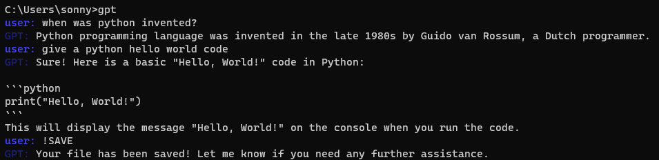
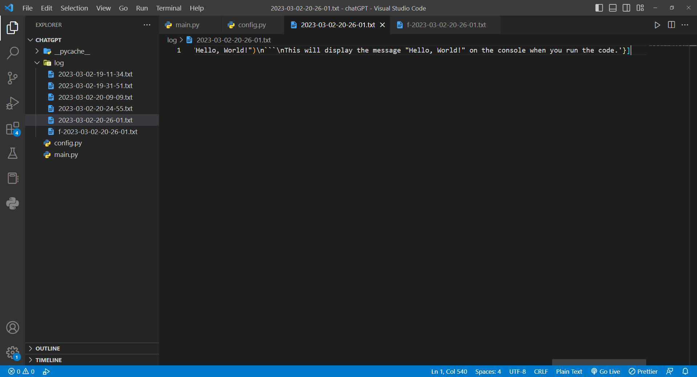
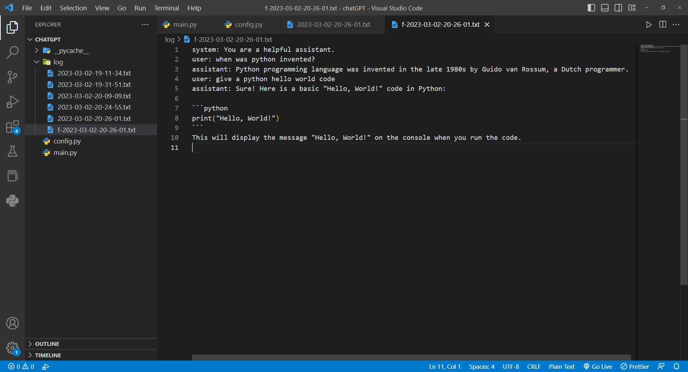

# ChatGPT-cli

## Installation

So far, this program can only run on Windows. To run chatGPT-cli, first clone this repository. Then, create a file named `config.py`, and write:
```python
OPENAI_API_KEY = 'key-from-openAI'
```
The API key can be obtained from [https://platform.openai.com/account/usage](https://platform.openai.com/account/usage).

To run `main.py`, please first do:
```shell
pip install openai
pip install colorama
```
At this point you can run the code using:
```shell
python main.py
```
However, you could also enable running this script by only typing `gpt` in the terminal. To do so, navigate to your Python's script folder, and create `gpt.bat` file. Its content should be
```bat
@echo off
python "C:\path\to\main.py" %*
```
Now, you can run the script using:
```shell
gpt
```

## Usage

Enter anything to let ChatGPT answer. Enter `!Q` to quit, enter `!SAVE` to save this session's chat to `.\log\` folder. The save includes a raw version that can be used to save session, and a formatted version that is more readable. Enjoy!

<p align="center">
  
  <br/>
</p>

<p align="center">
  
  <br/>
</p>

<p align="center">
  
  <br/>
</p>

<!-- [[/img/chatgpt_cli_demo_1.png]] -->

<!-- [[/img/chatgpt_cli_demo_2.png]] -->

<!-- [[/img/chatgpt_cli_demo_3.png]] -->